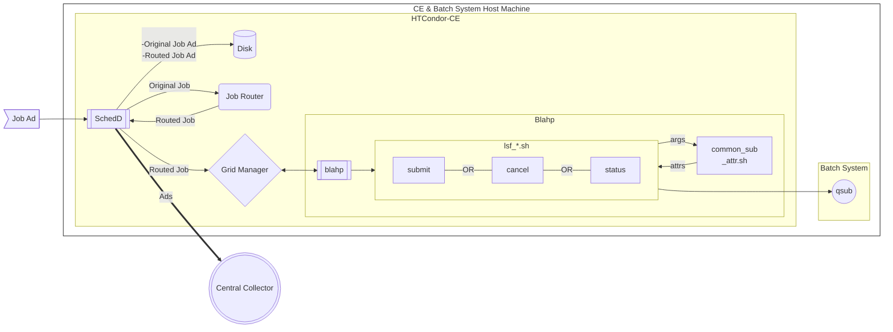
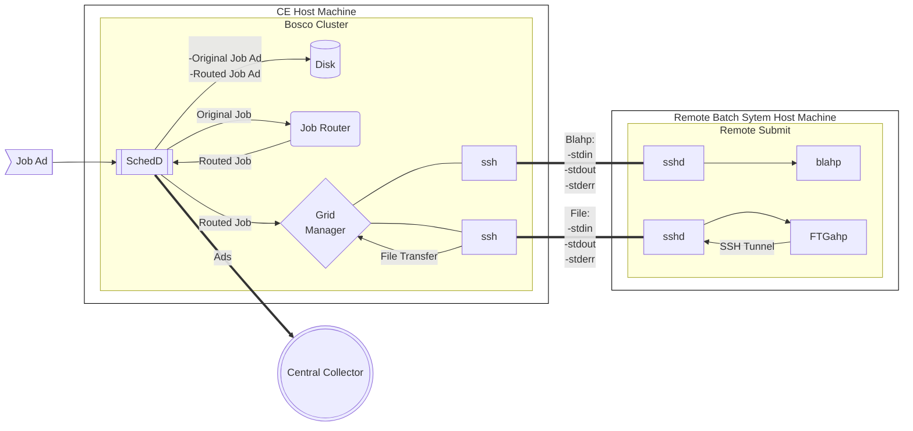

HTCondor-CE
===========

---

A site grid gatekeeper technology based solely on HTCondor components.

This package is simply a thin set of wrappers around HTCondor, allowing you to
run a HTCondor-CE without disrupting a site HTCondor install.

For example, `condor_ce_q` is the HTCondor-CE equivalent to `condor_q` for the
HTCondor-CE processes.  This package took much of its inspiration - and base 
code - from OSGs condor-cron package.

Sites are encouraged to install the sub-package `htcondor-ce-condor` or
`htcondor-ce-pbs`, depending on which batch manager they run.

Download
--------

HTCondor-CE RPMs are available from the following locations:

- HTCondor Yum repositories: https://research.cs.wisc.edu/htcondor/yum/
- OSG Yum repositories: https://opensciencegrid.org/docs/common/yum/

Versioning
----------

At any given time, two versions of HTCondor-CE are maintained, a stable and a development version.
In this repository, the `master` branch contains the latest version of HTCondor-CE (i.e. development) while the `stable`
branch contains the previous version.

- [Development](https://htcondor-ce.readthedocs.io/en/latest/): HTCondor-CE 4
- [Stable](https://htcondor-ce.readthedocs.io/en/stable/): HTCondor-CE 3

Issues
------

Please share any issues or questions regarding the HTCondor-CE via the following mailing lists:
- [htcondor-users@cs.wisc.edu](mailto:htcondor-users@cs.wisc.edu): For issues and questions open to the community.
- [htcondor-admin@cs.wisc.edu](mailto:htcondor-admin@cs.wisc.edu): For issues and questions containing private information.
- [htcondor-security@cs.wisc.edu](mailto:htcondor-security@cs.wisc.edu): For issues regarding security problems/vunerabilities.
  For more information regarding reporting security problems go to [HTCSS Security](https://htcondor.org/security/).

Diagrams
--------

Below are diagrams to show the flow of a Job submitted to an HTCondor-CE to being executed in
a different batch system. ***Diagram A*** showcases an setup where the HTCondor-CE is located on the
same host as the destination batch system. While ***Diagram B*** showcases a setup with the HTCondor-CE
submitting a job to a remote batch system.

> Note: In both setups the HTCondor-CE ***Schedd*** sends Master and Schedd Ads to the ***Central Collector***

### HTCondor-CE workflow (Diagram A)

### Bosco Cluster workflow (Diagram B)

In this setup where the HTCondor-CE submits to a remote batch system, incoming jobs
are required to specify ***grid_resource = \<batch\> \<system\> \<hostname\>***.

> Note: The ***Blaph*** on the remote host works exactly the same as in Diagram A
> except that the ***Grid Manager*** communicates over SSH.

