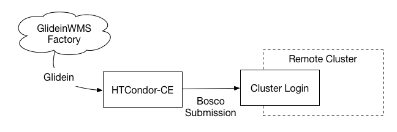

How Jobs Run
------------

Once an incoming pilot job is authorized, it is placed into HTCondor-CE’s scheduler where the Job Router creates a
transformed copy (called the *routed job*) and submits the copy to the batch system (called the *batch system job*).
After submission, HTCondor-CE monitors the batch system job and communicates its status to the original pilot job, which
in turn notifies the original submitter (e.g., job factory) of any updates.
When the batch job job completes, files are transferred along the same chain: from the batch system to the CE, then from
the CE to the original submitter.

### On HTCondor batch systems

For a site with an HTCondor **batch system**, the Job Router uses HTCondor protocols to place a transformed copy of the
pilot job directly into the batch system’s scheduler, meaning that the routed job is also the batch system job.
Thus, there are three representations of your job, each with its own ID (see diagram below):

-   Submitter: the HTCondor job ID in the original queue
-   HTCondor-CE: the incoming pilot job’s ID
-   HTCondor batch system: the routed job’s ID

In an HTCondor-CE/HTCondor setup, file transfer is handled natively between the two sets of daemons by the underlying
HTCondor software.

If you are running HTCondor as your batch system, you will have two HTCondor configurations side-by-side (one residing
in `/etc/condor/` and the other in `/etc/condor-ce`) and will need to make sure to differentiate the two when modifying
any configuration.

### On other batch systems

For non-HTCondor batch systems, the Job Router transforms the pilot job into a routed job on the CE and the routed job
submits a job into the batch system via a process called the BLAHP.
Thus, there are four representations of your job, each with its own ID (see diagram below):

-   Submitter: the HTCondor job ID in the original queue
-   HTCondor-CE: the incoming pilot job’s ID and the routed job’s ID
-   Non-HTCondor batch system: the batch system’s job ID

Although the following figure specifies the PBS case, it applies to all non-HTCondor batch systems:

With non-HTCondor batch systems, HTCondor-CE cannot use internal HTCondor protocols to transfer files so its "spool"
directory must be exported to a shared file system that is mounted on the batch system’s worker nodes.

### Hosted CE over SSH

The Hosted CE is designed to be an [HTCondor-CE as a Service](https://en.wikipedia.org/wiki/Software_as_a_service)
offered by a central grid operations team.
Hosted CEs submit jobs to remote clusters over SSH, providing a simple starting point for opportunistic resource
owners that want to start contributing to a computing grid with minimal effort.

If your site intends to run over 10,000 concurrent pilot jobs, you will need to host your own
[HTCondor-CE](v24/installation/htcondor-ce.md) because the Hosted CE has not yet been optimized for such loads.

How the CE is Customized
------------------------

Aside from the [basic configuration] required in the CE installation, there are two main ways to customize your CE (if
you decide any customization is required at all):

-   **Deciding which Virtual Organizations (VOs) are allowed to run at your site:** HTCondor-CE leverages HTCondor's
    built-in ability to [authenticate incoming jobs](v24/configuration/authentication.md) based on their OAuth
    token credentials.
-   **How to filter and transform the pilot jobs to be run on your batch system:** Filtering and transforming pilot jobs
    (i.e., setting site-specific attributes or resource limits), requires configuration of your site’s job routes.
    For examples of common job routes, consult the [job router configuration](v24/configuration/job-router-overview.md)
    pages.

How Security Works
------------------

In the grid, security depends on a PKI infrastructure involving Certificate Authorities (CAs) where CAs sign and issue
certificates.
When these clients and hosts wish to communicate with each other, the identities of each party is confirmed by
cross-checking their certificates with the signing CA and establishing trust.

In its default configuration, HTCondor-CE supports token-based authentication and authorization to the
remote submitter's credentials.
